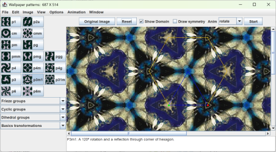

# wallpaper

The Wallpaper pattern Java application creates repeating
patterns based on an image and the 17 mathematical plane symmetry
groups.

See [https://singsurf.org/wallpaper/wallpaper.php](https://singsurf.org/wallpaper/wallpaper.php)

